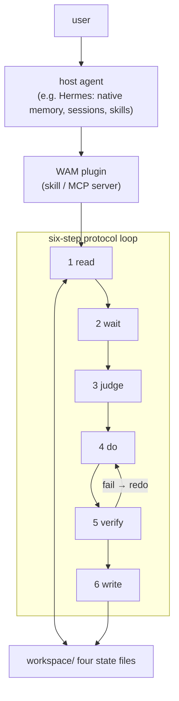

# Direction: agent-plugin

> Status: OPEN · Weight: critical path · Opened: 2026-08-07

## Hypothesis

The fastest verified path is **embedding WAM inside an existing agent** as a skill/plugin implementing the six-step protocol over workspace/ (e.g., a Hermes skill or an MCP server). Users get WAM's state discipline inside their current workflow; the demo is available immediately (run it on a real project this week).

## What would falsify this

- The host agent ignores or skips protocol steps (prompt-level enforcement is soft), so the state files rot.
- The added value is not distinguishable from the host agent's native memory / CLAUDE.md pattern.

## Inputs (evidence)

- docs/research/01-ecosystem-survey.md: "embed into or replace existing workflows?" is an open question; Claude Code's CLAUDE.md bloat (issue #42796) is the failure mode this must beat.
- The host platform (Hermes) already provides memory, sessions, and skills — the plugin only needs to add the shared-state discipline.

## Architecture

## Work log

- 2026-08-07: opened.
- 2026-08-07: architecture diagram added (mermaid).

## Next step

Vertical slice (scheduled, stage 2): a Hermes skill that runs read→wait→judge→do→verify→write over workspace/, used on WAM's own repo for one week; promotion gate: three consecutive sessions where the skill's state check caught something the host agent would have missed. Shares implementation with the substrate CLI.
