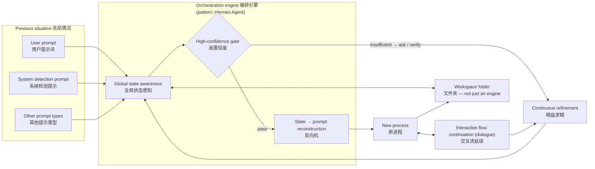

# Direction: global-route

> Status: OPEN (author-authored) · Weight: critical path · Opened: 2026-08-07

## Hypothesis

WAM is a **global orchestration entity** (architecture pattern inspired by Hermes Agent). A single persistent orchestrator with **global state awareness** that:

- ingests the previous situation — user prompts / system detection prompts / other prompt types,
- gates on **high confidence**,
- reconstructs situation → prompts via a reverse mechanism (反向机 — OCR of the author's sketch; possibly 反馈机 "feedback machine"; **needs author confirmation**),
- spawns **new processes**,
- **continues the interaction flow** across sessions (dialogue),
- **refines continuously** (精益求精).

The deliverable is the engine **plus the folder** (the living workspace) — "not just an engine" (author's note on the sketch).

## What would falsify this

- The resume-and-continue demo can be built faster and more robustly on an existing agent platform (e.g., Hermes itself), making a custom orchestrator redundant.
- Global state awareness at the engine level cannot be kept synchronized without becoming a heavyweight runtime (contradicting the 1% principle).

## Inputs (evidence)

- Author's sketch 2026-08-07 (PNG, reconstructed via OCR — pending author review of 反向机 and arrow semantics).
- idea.md: "no matter how many agents run beneath, what is presented to the user should be a unified, global, constructive collaboration entity."
- docs/research/01-ecosystem-survey.md: no framework offers human-readable shared state; the global orchestrator + folder pattern is unoccupied.
- Pattern reference: Hermes Agent (the platform this project is developed on) — persistent memory, session continuity, delegation, skills.

## Architecture

## Work log

- 2026-08-07: opened by author; sketch captured; OCR reconstruction done.
- 2026-08-07: architecture diagram added (mermaid).

## Next step

Minimal resume experiment (scheduled, stage 1 parallel): cross-session "continue" from workspace/ — open the repo in a fresh session, verify the state files alone restore the situation/goals/progress/decisions. No full engine. Pass → engine worth building; fail → falsified (existing platforms already do this).
