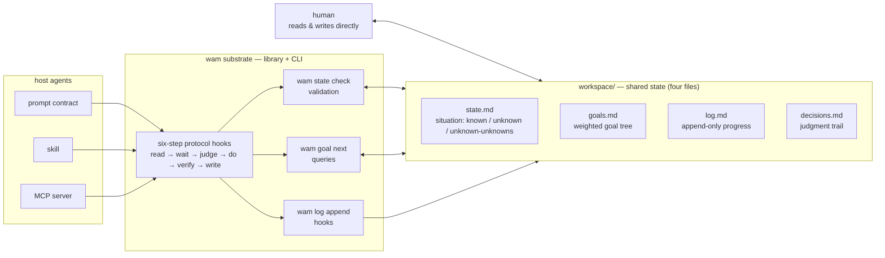

# Direction: substrate

> Status: OPEN · Weight: critical path · Opened: 2026-08-07

## Hypothesis

WAM's minimal useful form is a **state substrate**: a small library + CLI that implements the four-file state model (validation, queries, six-step protocol as hooks), with **no agent of its own**. Any agent — including existing ones — can adopt it (as a prompt contract, a skill, or an MCP server). Differentiation: the human-readable, human-editable, cross-session shared state that the survey shows nobody offers.

## What would falsify this

- A substrate without an attached agent turns out to be a markdown formatter — no real leverage.
- Protocol hooks are ignored by host agents (soft, prompt-level enforcement), so the state drifts back to "agent-internal memory" within a week.

## Inputs (evidence)

- docs/research/01-ecosystem-survey.md: human-readable shared state is a blue ocean; the verification gap is industry-wide.
- docs/research/02-memory-and-state.md: layering is consensus; "human-shared state" is unresearched — this is the blank space.
- M0 experience: the four files + six-step protocol have already carried WAM through 4 sessions without any runtime.

## Architecture

## Work log

- 2026-08-07: opened.
- 2026-08-07: architecture diagram added (mermaid).

## Next step

Vertical slice (scheduled, stage 1): a `wam` CLI (`state check`, `goal next`, `log append`) exercised on WAM's own workspace, plus an evidence checker for the Verify step (verify-gate merged in); promotion gate: the CLI must catch a real state-format error and answer "what's next" from goals.md without reading the files by hand; the checker must flag a "done" claim that carries no evidence.
