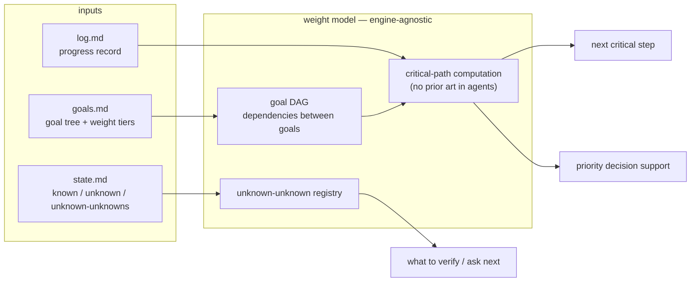

# Direction: weight-first

> Status: OPEN · Weight: critical path · Opened: 2026-08-07

## Hypothesis

Lead with WAM's original contribution: the **weight model** — goals as a DAG with explicit **critical-path computation** and an **unknown-unknown registry**, engine-agnostic (a library, or a section any route embeds). Research shows: CPM-in-agents has no dedicated literature; weight judgment is absent from every framework; the only precedent (CrewAI's LLM-inferred importance on save) is exactly the heuristic the literature criticizes.

## What would falsify this

- The computed critical path adds no decision value over a flat todo list in practice.
- The annotation burden (humans labeling weights) kills adoption — weights must be cheap to maintain.

## Inputs (evidence)

- docs/research/03-unknown-and-weight.md: CPM in LLM agent planning is unresearched (nearest: Vote-Tree-Planner, DART-LLM — neither uses CPM); "What Deserves Memory" (arXiv:2508.03341) criticizes heuristic importance scoring; Smithson's quadrant taxonomy matches state.md's three sections.
- docs/research/01-ecosystem-survey.md: no framework has critical-path/enhancement/noise tiers.

## Architecture

## Work log

- 2026-08-07: opened.
- 2026-08-07: architecture diagram added (mermaid).

## Next step

Vertical slice (scheduled, stage 3): weight-tiered goal DAG + critical-path computation over WAM's own goals.md (pure local prototype); promotion gate: within two weeks, the computed critical path changed (or prevented) a priority decision that the flat todo would not have caught.
