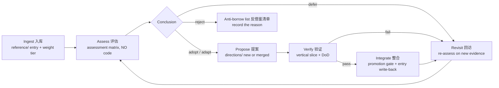

# Borrow-to-R&D Workflow — 借鉴研发工作流

> Established 2026-08-07. The scientific pipeline that turns a paper in `reference/` into a verified part of WAM — or explicitly rejects it. Assessment and development happen AFTER ingestion, gated at every stage. No mechanism enters a direction proposal without passing the assessment matrix; no mechanism enters the official structure without the promotion gate.

## The pipeline

## Stage 1 — Ingest 入库 (exists)

Write the full entry (method, experiments, limitations, WAM mapping, evaluation criteria, R&D path) and assign a weight tier. **This stage is complete for the current 5 papers.**

## Stage 2 — Assess 评估 (NEW — no code allowed)

The scientific gate. For each paper, in priority order (critical first, enhancement second, noise never), produce an assessment report using the matrix template (`reference/templates/assessment-matrix.md`).

**Six dimensions:**

| Dimension | Question | Evidence to cite |
|---|---|---|
| Problem fit 问题契合度 | Which of the four deficiencies (constructiveness / continuity / verifiability / weight judgment) does it actually solve? | idea.md mapping; if it solves none, it stops here |
| Evidence strength 证据强度 | How strong are the experiments? | benchmarks, ablations, consistency across settings; note single-domain results |
| Portability 可移植性 | Can the mechanism survive transfer from its domain (robots, web tasks, RL) to human-AI project collaboration? | domain-gap analysis; flag mechanisms whose value depends on the original setting |
| Cost 成本 | Implementation cost vs the 1% principle | rough component estimate; multi-agent machinery needs an explicit justification |
| Risk 风险 | Which known failure modes does it import? | retrieval misses, drift, verbosity pathology, annotation burden |
| Tension 张力 | Does it validate the M0 bet or overturn it? | relation to state model + protocol; BMAM-style independent convergence counts as evidence FOR |

**Conclusion options** (exactly one): adopt / adapt (mechanism modified for WAM's context) / defer (interesting, wrong timing) / reject (fails the matrix — goes to the anti-borrow list).

**Hard gates:**
- No assessment report → no proposal. A paper's ideas cannot skip the matrix.
- Defer and reject are *recorded*, not forgotten — they re-enter via the Revisit stage.
- Assessment is AI-drafted, **author-approved**: the AI supplies evidence and a recommendation; the human makes the final weight judgment (per the protocol's 停/判 steps).

**Time box: ≤ 1 session per paper.** If a paper needs more, split the assessment, don't extend.

## Stage 3 — Propose 提案

Passed mechanisms become (or merge into) a direction in `directions/` with: hypothesis, falsification condition, and the minimal experiment. Follows existing governance (evidence / proposals / decisions tiers).

## Stage 4 — Verify 验证

The minimal falsification experiment (vertical slice) defined in the direction's README. Same rules as any WAM work: DoD green, evidence recorded, no bluffing.

## Stage 5 — Integrate 整合

Passes the promotion gate: decision recorded in `workspace/decisions.md`, evidence cited, artifact relocated, direction archived. **Then write back into the reference entry**: what was adopted, how it was modified, and the verification evidence — the entry's status becomes `adopted` or `adapted`.

## Stage 6 — Revisit 回访

- **Triggers**: new papers enter the library; a milestone completes; a deferred/rejected mechanism gets new evidence; the state model evolves (state-v2).
- Deferred entries are re-assessed with the new evidence; adopted entries are re-checked against later results (e.g., BMAM's ablations vs follow-up work).
- The anti-borrow list is itself revisited — a rejection is a statement about *today's* WAM, not forever.

## Anti-borrow list 反借鉴清单 (current)

Things the library has already marked as NOT to adopt, with reasons:

| Mechanism | Why rejected (so far) |
|---|---|
| Vector retrieval as the primary state store | Retrieval misses / staleness failure modes (docs/research/02); human-readable direct read wins until evidence says otherwise (state-v2 question) |
| RL-driven memory management (survey 7.3) | Minimizes human-engineered priors — WAM's human-curated files are a deliberate counter-position; revisit only if substrate fails at scale |
| Multi-agent coordinator machinery (BMAM) as WAM's core | idea.md: agent count is an implementation detail; BMAM's value for WAM is its memory structure, not its coordinator (assess that, not this) |
| Raw-trajectory dumps into context (Synapse-style) | ADAMEM's verbosity pathology (52.1→47.8 at larger k); log.md must answer in one line, not one page |

## Entry statuses in reference/README.md

`ingested` → `assessing` → `adopted` / `adapted` / `deferred` / `rejected`. The index table tracks the live status of every paper.
